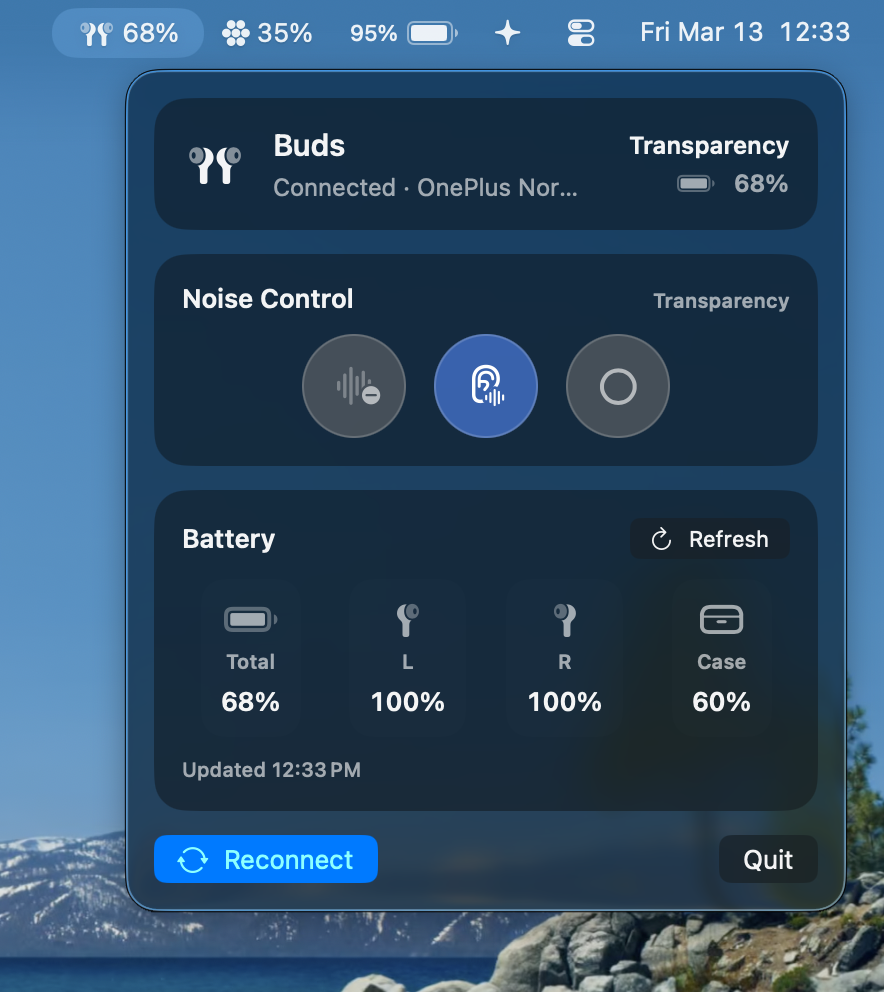
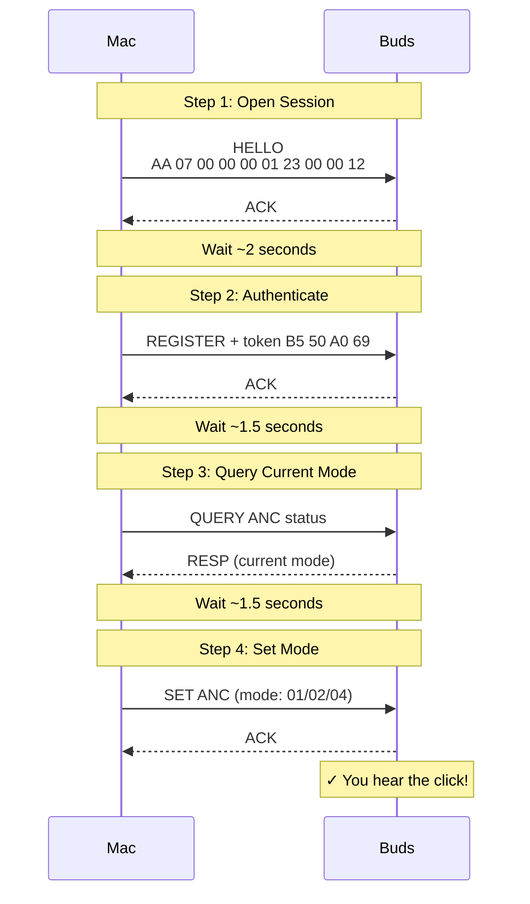
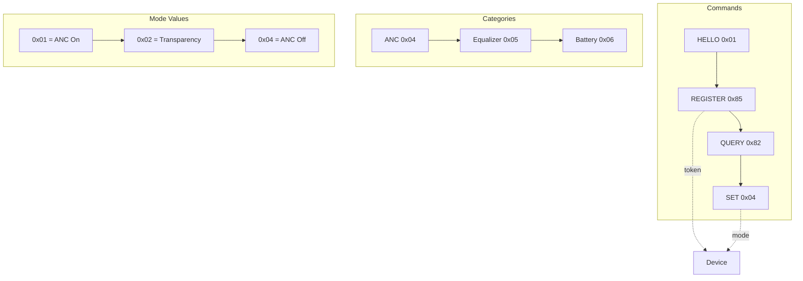

# Cracking OPOv1: Reverse Engineering the OnePlus Buds Protocol

Control your OnePlus Nord Buds 3 Pro ANC modes directly from your Mac — without the HeyMelody app.

**[Read the full reverse engineering story →](https://aasheesh.vercel.app/blog/oneplus-buds)**

## Demo

[](media/demo.mov)

---

## Attribution / Credits

This project is possible because **Aasheesh** reverse engineered the OnePlus/OPOv1 protocol and published the original work (blog + reference implementation).

- Original repo (protocol cracking / CLI groundwork): https://github.com/AasheeshLikePanner/cracked-oneplus-buds
- Reverse engineering write-up: https://aasheesh.vercel.app/blog/oneplus-buds

The **macOS menu bar app** and ongoing app-level development in this repository is done by **Vedanth**.

---

## The Problem

You're working on your laptop. Earbuds connected via Bluetooth. You want to switch from Transparency to ANC mode but the gesture won't work. No problem — you'll just use the official app.

**Oh wait.** There is no desktop app. OnePlus never made one. You need your phone just to change a setting on earbuds you already own.

That's absurd. The hardware link exists — Bluetooth is already connected. But software control? Locked behind a phone app.

So I decided to crack it myself.

---

## How We Cracked It

### 1. The btsnoop Capture

Android lets you enable **Bluetooth HCI snoop logging** in developer options. Every BLE packet between your phone and the earbuds gets captured. I copied that log to my laptop and opened it in Wireshark.

### 2. Decompiling HeyMelody

The official HeyMelody app has to communicate with the earbuds somehow. I pulled the APK, ran it through **jadx** (Java decompiler), and found the exact Java code that builds ANC commands.

```java
// Category = 0x04 (ANC), Sub-command = 0x04 (Set)
// Combined = 1028 = 0x0404
```

### 3. Finding the Right Service

The earbuds expose multiple BLE GATT services. Most people (including me initially) assumed the **FE2C** service was the main one.

**Wrong.** FE2C is for telemetry and firmware updates. The actual ANC commands go through **`0000079A`** — the OPO (Oppo/OnePlus) protocol service.

### 4. The Write Type Trap

In CoreBluetooth, there are two write types:
- `.withResponse` — waits for acknowledgment
- `.withoutResponse` — fire and forget

The earbuds **only** accept `.withoutResponse`. Using `.withResponse` silently fails. No error. No response.

### 5. Authentication Required

You can't just send an ANC command. First you must:
1. Send **HELLO** packet
2. Wait 2 seconds
3. Send **REGISTER** with device token `B5 50 A0 69`
4. Wait 1.5 seconds
5. Then you can send commands

### 6. The Response Channel Problem

The earbuds send responses on **both** `0000079A` AND `FE2C` services. If you only subscribe to one, you miss the responses.

The fix? Subscribe to notifications on **every** characteristic across **both** services.

---

## Quick Start

```bash
chmod +x nordbuds.swift

./nordbuds.swift on      # ANC On
./nordbuds.swift off     # ANC Off  
./nordbuds.swift trans   # Transparency
./nordbuds.swift battery # Battery levels
./nordbuds.swift info    # Device info
./nordbuds.swift eq      # EQ settings
```

---

## macOS Menu Bar App

This repo also includes a native macOS menu bar app.

- App overview: `README_APP.md`
- Detailed architecture + “no polling” docs: `docs/README.md`

---

## Command Flow



---

## Key Packets

| Packet | Hex | Description |
|--------|-----|-------------|
| HELLO | `AA 07 00 00 00 01 23 00 00 12` | Open session |
| REGISTER | `AA 0C 00 00 00 85 41 05 00 00 B5 50 A0 69` | Auth with token |
| ANC ON | `AA 0A 00 00 04 04 42 03 00 01 01 01` | Mode = 0x01 |
| ANC OFF | `AA 0A 00 00 04 04 40 03 00 01 01 04` | Mode = 0x04 |
| TRANSPARENT | `AA 0A 00 00 04 04 42 03 00 01 01 02` | Mode = 0x02 |

---

## Packet Structure

```
┌──────┬──────┬──────┬──────┬──────┬──────┬──────┬──────┬──────┬──────┬───────┐
│ SOF  │ LEN  │ PAD  │ PAD  │ CAT  │ SUB  │ SEQ  │ FLAG │ D0   │ D1   │ MODE  │
│  AA  │  0A  │  00  │  00  │  04  │  04  │  42  │  03  │  00  │  01  │  01   │
│ byte0│ byte1│ byte2│ byte3│ byte4│ byte5│ byte6│ byte7│ byte8│ byte9│ byte11│
└──────┴──────┴──────┴──────┴──────┴──────┴──────┴──────┴──────┴──────┴───────┘

SOF:  Always 0xAA (start of frame)
LEN:  Length from CAT to end
CAT:  0x00=System, 0x04=ANC, 0x05=EQ, 0x06=Battery
SUB:  0x01=Hello, 0x85=Register, 0x04=Set, 0x82=Query
MODE: 0x01=ANC On, 0x02=Transparency, 0x04=ANC Off
```

---

## GATT Services

| Service | UUID | Purpose |
|---------|------|---------|
| **OPO** | `0000079A-D102-11E1-9B23-00025B00A5A5` | Main command channel |
| Write | `0100079A-...` | Send commands (must use .withoutResponse) |
| Notify | `0200079A-...` | Receive responses |
| FE2C | `FE2C...` | Device telemetry (also receives responses!) |

---

## OPO Protocol Overview



---

## What We Learned

1. **Big companies don't document protocols on purpose** — it's how they lock you into their ecosystem
2. **btsnoop captures are the ground truth** — read packets first, guess second
3. **BLE silently fails** — wrong write type, wrong service, wrong channel. No errors.
4. **The fix was simple** — subscribe to both services

---

## Compatible Devices

This protocol works on all devices using **OPOv1** (Oppo Protocol) — the same protocol across the BBK Electronics audio ecosystem:

### ✅ Confirmed Working
- **OnePlus Nord Buds 3 Pro**

### 🔄 Likely Compatible (OPOv1 Devices)

**OnePlus:**
- Nord Buds 3
- Nord Buds CE 5G
- Nord Buds 2
- Buds Pro 2
- Buds Pro
- Bullets Wireless Z2
- Bullets Wireless Z

**Oppo:**
- Enco X2
- Enco Free2
- Enco Free2i
- Enco Air3
- Enco Air2 Pro
- Enco Air2

**Realme:**
- Buds Air 5 Pro
- Buds Air 3
- Buds Air 2 Pro
- Buds T1

> **Note:** The token `B5 50 A0 69` works for Nord Buds 3 Pro. Other devices may use different tokens. Try the script — it should work!

---

## Troubleshooting

**No response?**
- Make sure buds are connected to your Mac via Bluetooth

**Command ignored?**
- Using `.withResponse` — must be `.withoutResponse`
- Missing authentication — you MUST send HELLO + REGISTER first

**No ACK?**
- Subscribe to notifications on BOTH 0000079A AND FE2C characteristics

---

## Requirements

- macOS
- Xcode Command Line Tools
- OPO-based earbuds (paired to Mac)

---

## License

MIT
