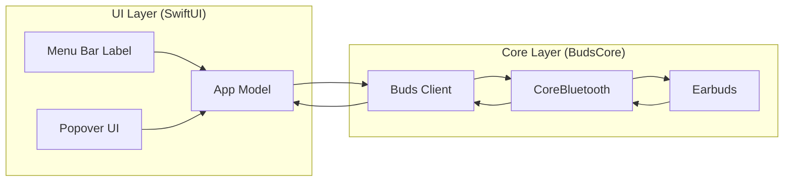
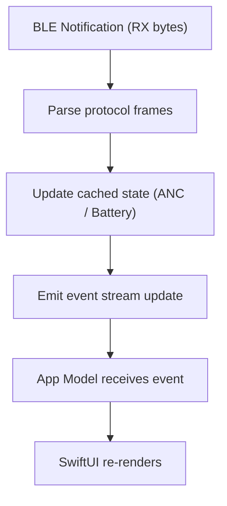

# Architecture (No-Polling, Event-Driven)

The app has one job: let you control and view your buds (ANC + battery) from a **macOS menu bar popover**.

The key design rule is:

> **No polling.**  
> The app does *not* run repeating timers that keep querying the buds.

Instead, it’s **event-driven**:

- The buds can **push updates** over BLE notifications (when we’re listening)
- The app sends **one-shot commands** only when you open the popover or tap a button

---

## Components

### UI layer (Menu bar + Popover)

- Shows current state (Connected?, ANC mode, battery)
- Sends user intents (Set ANC, Refresh battery, Reconnect)
- Enables/disables “Live Updates” depending on whether the popover is open

### Bluetooth layer (Buds Client)

- Owns the BLE connection to the buds
- Subscribes/unsubscribes to notifications (“live updates”)
- Performs the one-time handshake (HELLO → REGISTER) when needed
- Parses incoming frames and publishes state updates to the UI

---

## Component Diagram

---

## Data Flow (Event-Driven)

---

## Key UX / Battery Tradeoff

**Live updates only when the popover is open**:

- Popover open = subscribe to notifications = very responsive + can mirror earbud gestures
- Popover closed = unsubscribe = minimal BLE traffic + lower earbud battery impact

That means the menu bar can occasionally be “stale” while the popover is closed — by design.

