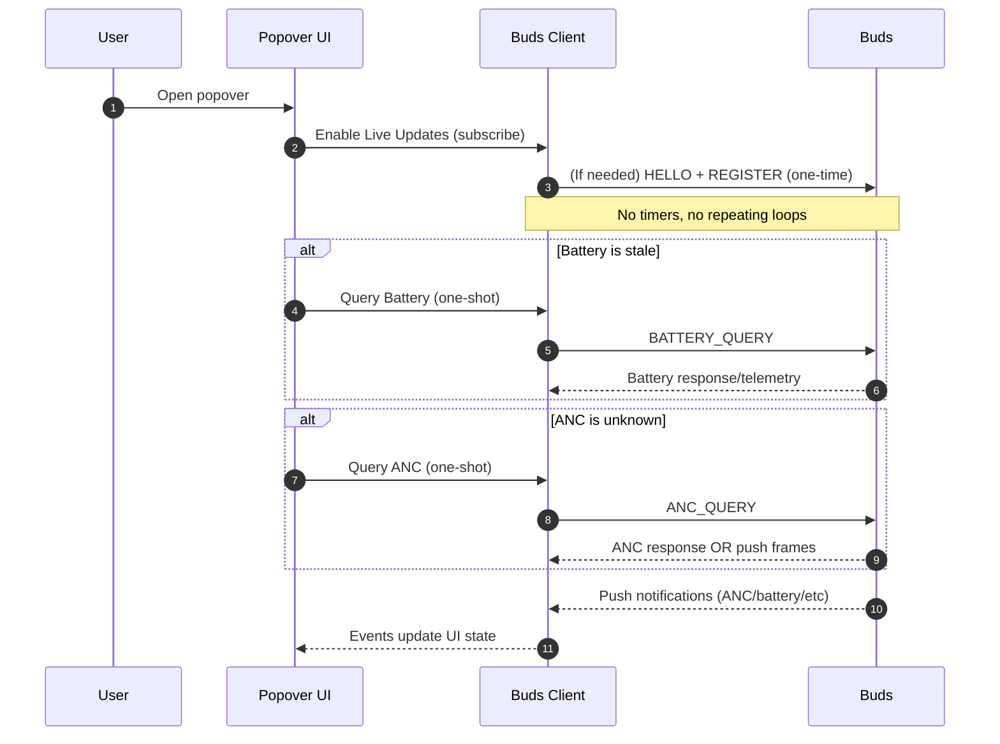

# No Polling (What We Mean, What Happens Instead)

## What “polling” means here

Polling is when the app runs a repeating timer like:

- “Every 10 seconds, ask the buds for ANC mode”
- “Every 2 minutes, ask the buds for battery”

That is **not** what this app does.

## What is *not* happening

- No repeating timers for ANC
- No repeating timers for battery
- No “background refresh loop” when you’re not interacting

If the app is idle and the popover is closed, it should be very quiet on Bluetooth.

## What *does* trigger BLE traffic

### 1) Popover open (on-demand)
When you open the popover:

1. **Live Updates ON** (subscribe to notifications)
2. **Handshake if needed** (HELLO → REGISTER) so the buds will talk back reliably
3. **Optional one-shot queries**:
   - Battery query, but only if the last battery is old (stale)
   - ANC query, but only if ANC is currently unknown

### 2) Button taps (user intent)
When you tap:

- **ANC button** → send a single “set ANC” command
- **Refresh** → send a single “battery query”
- **Reconnect** → reconnect BLE (no periodic retries beyond reconnect backoff)

### 3) Buds push updates (no app queries)
When Live Updates are ON, the buds may push:

- ANC changes you do with earbud gestures (depending on firmware behavior)
- Telemetry packets that contain battery information

This is **the buds streaming**, not the app polling.

---

## Popover Open Sequence

---

## Why we still sometimes do one-shot queries

Two reasons:

1) Some firmware doesn’t push ANC immediately on connect/open  
2) Battery can be unknown until you explicitly ask or until telemetry appears

So we allow *one-shot* queries **only** when you open the popover or press Refresh — never on a timer.

