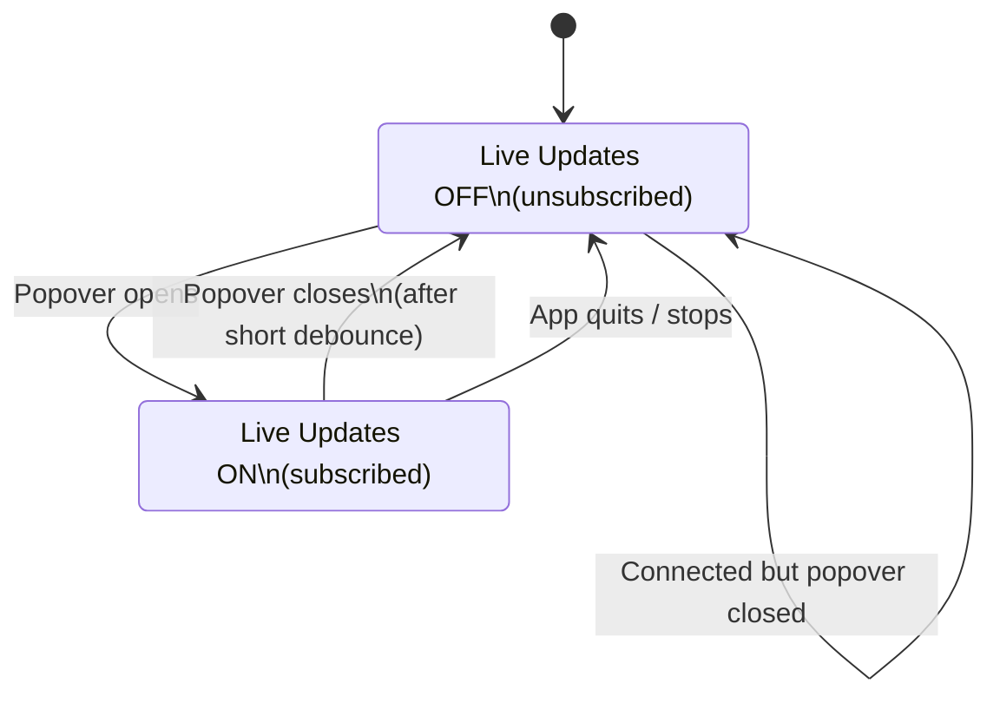

# Notifications & Live Updates (When the Buds Talk to the Mac)

## Two different “connections”

1) **Connected**  
The Mac has a BLE connection to the buds.

2) **Listening (Live Updates enabled)**  
The Mac has subscribed to BLE notifications, so the buds can *push* updates.

You can be “connected” but not “listening”.

---

## What Live Updates does

Live Updates = subscribing/unsubscribing from safe BLE notification characteristics.

- **Enabled (popover open):**
  - We subscribe to notifications
  - Buds may start streaming telemetry
  - ANC changes from gestures *can* be reflected live (device-dependent)

- **Disabled (popover closed):**
  - We unsubscribe
  - Buds usually stop streaming
  - This reduces BLE traffic and bud battery impact

---

## Live Updates State Machine

---

## Popover Close Debounce (why it exists)

SwiftUI popovers can sometimes “jitter” lifecycle callbacks (open/close) during UI changes.

To avoid accidentally flapping notifications on/off:

- We wait a short moment after “close” before disabling Live Updates.
- If the popover re-opens during that time, we keep Live Updates ON.

This preserves reliability and avoids missing push updates.

---

## Why the buds sometimes “spam” packets

When subscribed, many earbuds send frequent telemetry frames.

Important:

- That’s the **buds streaming while subscribed**
- It is not the app “polling”

The “no polling” strategy is still valid — but we also minimize the time we stay subscribed to keep the buds quieter.

